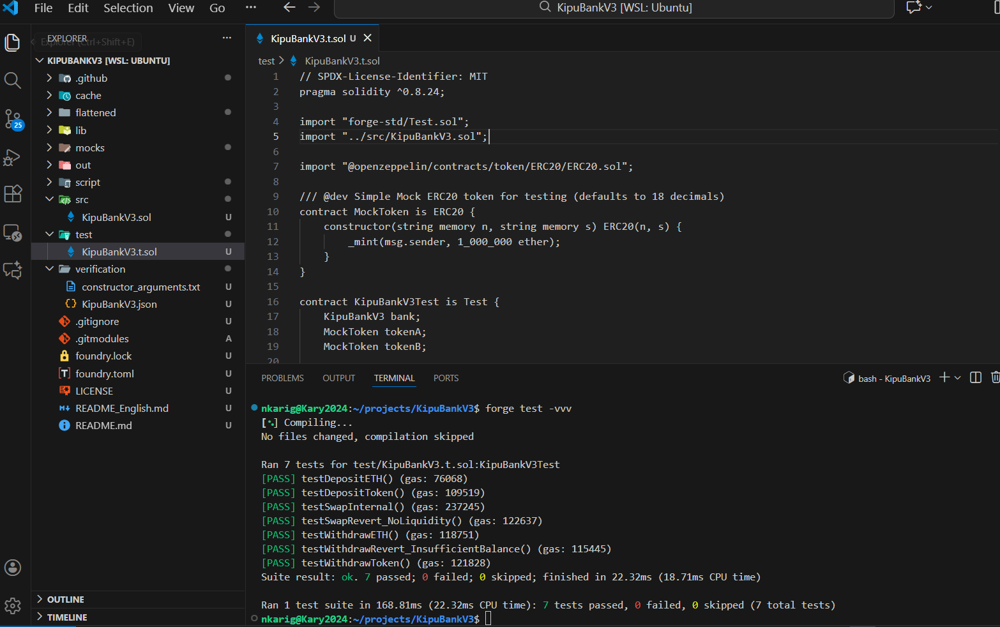
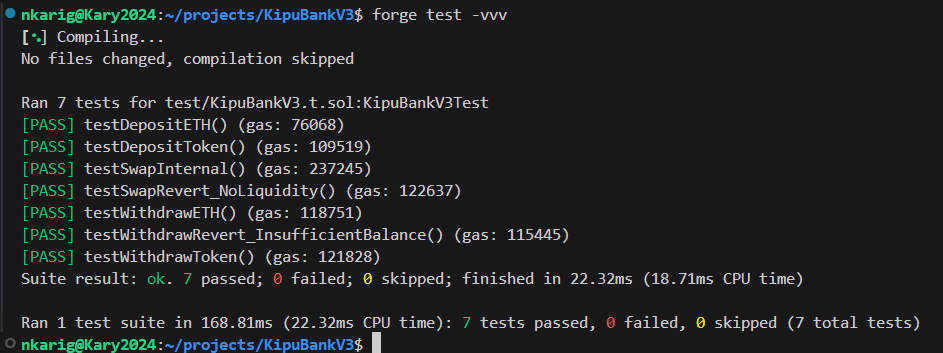
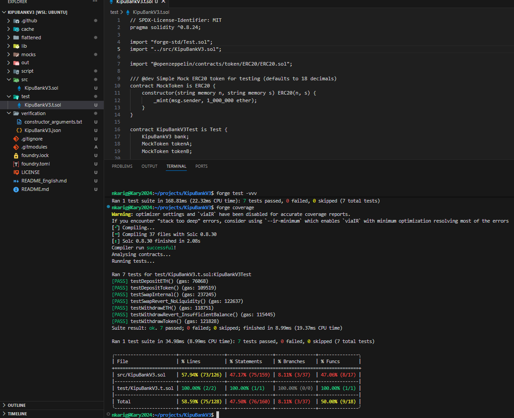
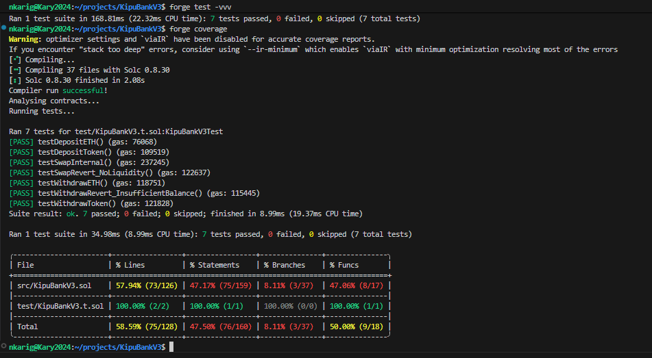

# 🛡️ KipuBankV3 – Informe de Análisis de Amenazas y Auditoría Inicial (Foundry)

**Autora:** Nidia Karina Garzón Grajales  
**Programa:** ETH-KIPU / Módulo 5 – Preparación para Auditoría  
**Fecha:** 19/11/2026  

📄 Puedes descargar el informe completo aquí:  
[**Informe_de_Seguridad.pdf**](./docs/TP5 - Informe_de_Seguridad.pdf)

---

## 1. Descripción general del protocolo

KipuBankV3 es un contrato inteligente que implementa una bóveda / banco multi-activo en Ethereum, permitiendo manejar depósitos y retiros de **ETH nativo** y **tokens ERC-20**, aplicar caps de seguridad, realizar swaps internos simples y gestionar permisos administrativos mediante Ownable y AccessControl.

El contrato lleva:

- `balances[usuario][token]` → saldo interno por usuario y token  
- `totalDepositedPerToken[token]` → TVL por token  
- Caps configurables: `bankCapPerToken`, `withdrawCapPerToken`, `bankCapUsdETH`  
- Swaps internos 1:1 ajustados por decimales  
- Protección con **ReentrancyGuard** y uso del patrón **CEI**

Incluye también custom errors, emisión de eventos y validaciones que ayudan a mantener un estado coherente.

---

## 2. Evaluación de madurez del protocolo

### 2.1 Cobertura de pruebas

Realicé pruebas:

- Manuales en Remix y Sepolia  
- Unitarias con Foundry (`forge test`)  
- Validación de rutas de revert  
- Pruebas adversarias inspiradas en OWASP 2025  
- Cobertura con `forge coverage`

### 2.2 Métodos de prueba utilizados

Incluyó mentalidad de arquitectura, lógica de exploiter, validación CEI, y revisión de roles críticos. También verificación de rutas de error: `ZeroAmount`, `InsufficientBalance`, `WithdrawLimitExceeded`, `InsufficientLiquidity`, etc.

### 2.3 Roles y superficie de ataque

- **Owner** y **BANK_ADMIN_ROLE** tienen permisos extensos  
- Pueden alterar caps, mover fondos, cambiar oráculos  
- Esto crea un modelo de confianza fuerte y riesgos si la clave es robada

### 2.4 Seguridad por diseño

- Custom errors  
- Eventos en todas las operaciones críticas  
- CEI + ReentrancyGuard  
- Documentación interna adecuada  
- Falta completar fuzzing y pruebas profundas de escenarios adversarios

---

## 3. Vectores de ataque y vulnerabilidades identificadas

Este análisis se enfocó en:  
- Supuestos técnicos del protocolo  
- Invariantes internas  
- Riesgo económico  
- Poderes administrativos

### Cuadro resumen de vulnerabilidades

| ID  | Vulnerabilidad                                                | Probabilidad | Severidad |
|-----|---------------------------------------------------------------|--------------|-----------|
| 3.1 | Swap 1:1 sin fuente de precio                                 | Excepcional  | Alta      |
| 3.2 | Supuestos incorrectos sobre tokens ERC-20                     | Rara         | Media-Alta|
| 3.3 | Poderes administrativos y rescates sin límites                | Excepcional  | Alta      |
| 3.4 | Caps extremos (0 o muy bajos)                                 | Ocasional    | Media     |

Estas vulnerabilidades no destruyen el contrato directamente, pero sí pueden comprometer fondos si se utiliza en un entorno real.

---

## 4. Métodos de prueba y cobertura (Foundry)

Para complementar las pruebas manuales, construí una suite de pruebas automatizadas con Foundry.  
No busqué 100% de cobertura, sino validar:

- Entradas válidas  
- Entradas inválidas → revert correcto  
- Estado interno consistente  
- Respeto de caps y límites  
- Correcto uso de ReentrancyGuard  

### Comandos utilizados:

- forge build
- forge test -vvv
- forge coverage

---

### 📸 Capturas de pruebas (forge test -vvv)

#### Parte 1  

#### Parte 2  

---

### 📊 Capturas de cobertura (forge coverage)

#### Parte 1  

#### Parte 2  

---

### Resultado numérico relevante
En esta versión del protocolo, `forge coverage` reportó:

- **57.94%** de líneas cubiertas  
- **47.17%** de statements en `src/KipuBankV3.sol`  
- Cerca del **50%** de funciones ejercitadas  

---

## 5. Recomendaciones

Mis recomendaciones principales para fortalecer el protocolo:

### 5.1 Mejorar el sistema de swap
- Usar solo stablecoins whitelisteadas  
- Documentar swap como didáctico  
- Para un entorno real: oráculos o curvas AMM

### 5.2 Controlar mejor los tokens permitidos
- Lista blanca estricta  
- Tests con tokens “raros” (fee-on-transfer)  
- Acreditar solo lo realmente recibido

### 5.3 Reducir riesgos del owner/admin
- Limitar rescates a excedentes reales  
- Multisig  
- Time-lock

### 5.4 Validación de caps
- Evitar caps extremos  
- Valores razonables por defecto  
- Pruebas específicas para caps peligrosos

### 5.5 Mejorar la suite de pruebas
- Añadir fuzzing  
- Probar fallas del oráculo  
- Tests administrativos  
- Pruebas de liquidez mínima y swaps fallidos  

---

## 6. Conclusiones

KipuBankV3 demuestra:

- Funcionalidad completa para un banco multi-activo  
- Buen diseño CEI + ReentrancyGuard  
- Estado interno coherente bajo pruebas  
- Riesgos económicos y administrativos que deben mitigarse

La cobertura del ~58% es suficiente para validar los flujos principales, aunque todavía hay margen de mejora.

---

## 6.1 Aprendizaje personal

Este análisis me permitió ver:

- Que los riesgos no siempre están en el código, sino en la lógica económica  
- Que los tokens ERC-20 no estándar pueden dañar un protocolo sano  
- Que los roles administrativos son un punto crítico en cualquier auditoría

---

## 6.2 Próximos pasos si continúo el proyecto

- Implementar mitigaciones propuestas  
- Añadir fuzzing + pruebas adversarias  
- Usar multisig para roles críticos  
- Rediseñar o eliminar swap para V4  
- Buscar una revisión externa  

---

## 6.3 Cierre personal

Este módulo me enseñó a mirar un contrato no solo como desarrolladora, sino con mentalidad de seguridad.  
KipuBankV3 es un buen paso, pero este análisis me deja con una visión más clara para seguir creciendo hacia prácticas reales de auditoría y desarrollo seguro.

---

